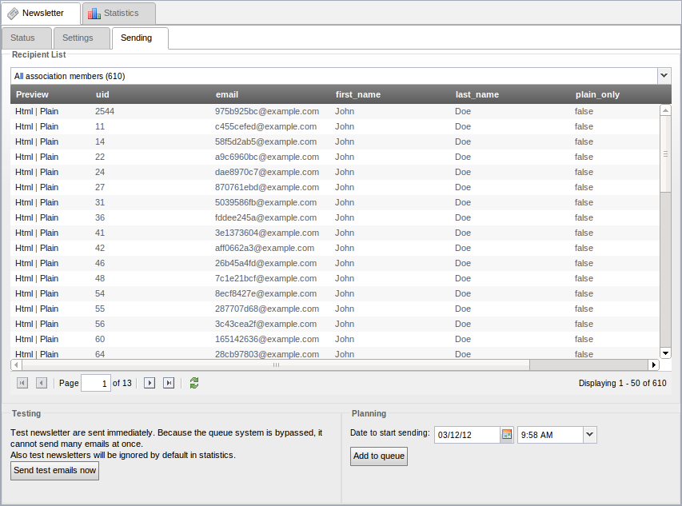
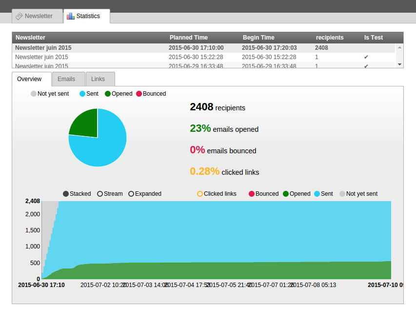
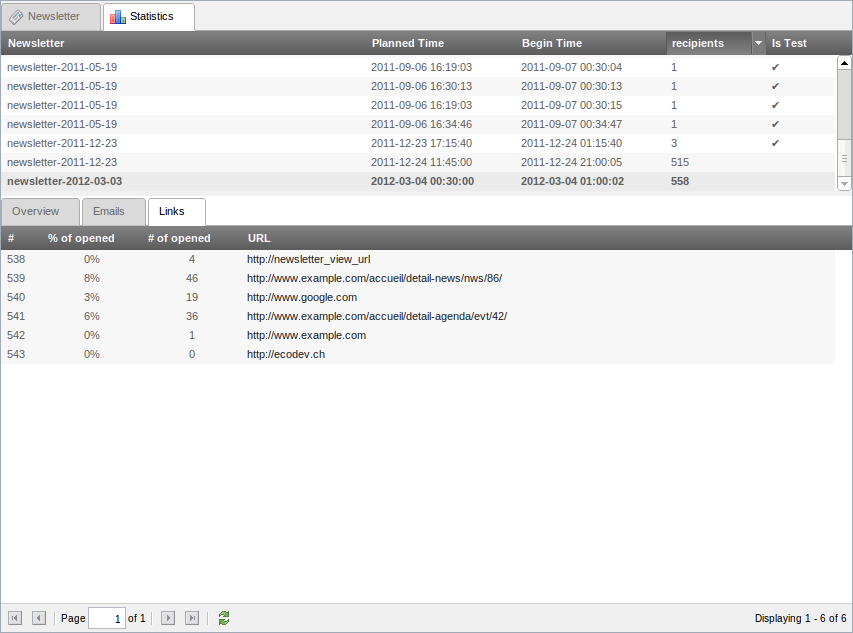

.. ==================================================
.. FOR YOUR INFORMATION
.. --------------------------------------------------
.. -*- coding: utf-8 -*- with BOM.

.. include:: ../Includes.txt

.. _introduction:

Introduction
============

.. _what-it-does:

What does it do?
----------------

A TYPO3 extension to send any pages as a newsletter to several recipients at 
once.

Originally based on `TC Directmail`_ 2.0.2,
the mailing engine was almost entirely rewritten but most features were 
preserved.We now use SwiftMailer (from TYPO3 core). And it aims to improve the 
user experience and works out of the box.

.. _TC Directmail: http://typo3.org/extensions/repository/view/tcdirectmail/current/

.. _how-it-compares:

Comparison with TC Directmail 2.0.2
-----------------------------------

What's better
^^^^^^^^^^^^^

-  Use of `SwiftMailer`_
-  Brand new database structure allowing for much more size efficient
   storage
-  Two special markers available: :code:`###newsletter_view_url###` and
   :code:`###newsletter_unsubscribe_url###`
-  Better cleaning of javascript in email content
-  Plain text quality is improved

What's worse
^^^^^^^^^^^^

-  Removed wizard for recipientlist generation
-  Only one recipient list per newsletter (workaround: send multiple
   newsletter or UNION via raw sql)

.. _SwiftMailer: http://swiftmailer.org/

.. _screenshots:

Screenshots
-----------

Current status of newsletter
^^^^^^^^^^^^^^^^^^^^^^^^^^^^

.. figure:: ../Images/Newsletter_-_Status.png
   :alt: Status of Newsletter

Settings for newsletter
^^^^^^^^^^^^^^^^^^^^^^^

.. figure:: ../Images/Newsletter_-_Settings.png
   :alt: Settings for Newsletter

Newsletter planning (and testing)
^^^^^^^^^^^^^^^^^^^^^^^^^^^^^^^^^

Statistics overview with charts for one newsletter
^^^^^^^^^^^^^^^^^^^^^^^^^^^^^^^^^^^^^^^^^^^^^^^^^^

Statistics of all emails for one newsletter
^^^^^^^^^^^^^^^^^^^^^^^^^^^^^^^^^^^^^^^^^^^

.. figure:: Images/Statistics_-_Emails.png
   :alt: Statistics of all emails for one newsletter

Statistics of all links for one newsletter
^^^^^^^^^^^^^^^^^^^^^^^^^^^^^^^^^^^^^^^^^^

