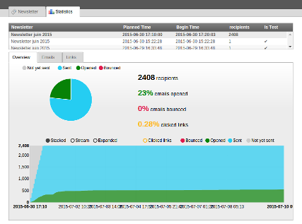

Newsletter |badge_travis| |badge_scrutinizer| |badge_coverage| |badge_gitter|
=============================================================================

.. |badge_travis| image:: https://travis-ci.org/Ecodev/newsletter.svg?branch=master
    :target: https://travis-ci.org/Ecodev/newsletter

.. |badge_scrutinizer| image:: https://scrutinizer-ci.com/g/Ecodev/newsletter/badges/quality-score.png?b=master
   :target: https://scrutinizer-ci.com/g/Ecodev/newsletter

.. |badge_coverage| image:: https://scrutinizer-ci.com/g/Ecodev/newsletter/badges/coverage.png?b=develop
   :target: https://scrutinizer-ci.com/g/Ecodev/newsletter

.. |badge_downloads| image:: https://poser.pugx.org/ecodev/newsletter/downloads
   :alt: Total Downloads
   :target: https://packagist.org/packages/ecodev/newsletter

.. |badge_version| image:: https://poser.pugx.org/ecodev/newsletter/v/stable
   :alt: Latest Stable Version
   :target: https://packagist.org/packages/ecodev/newsletter

.. |badge_license| image:: https://poser.pugx.org/ecodev/newsletter/license
   :alt: License
   :target: https://packagist.org/packages/ecodev/newsletter

.. |badge_gitter| image:: https://badges.gitter.im/Ecodev/newsletter.svg
   :alt: Join the chat at https://gitter.im/Ecodev/newsletter
   :target: https://gitter.im/Ecodev/newsletter?utm_source=badge&utm_medium=badge&utm_campaign=pr-badge&utm_content=badge

A TYPO3 extension to send any pages as a newsletter to several recipients at once.

Originally based on `TC Directmail`_ 2.0.2,
the mailing engine was almost entirely rewritten but most features were preserved.
We now use SwiftMailer (from TYPO3 core). And it aims to improve the user
experience and works out of the box.

Read more in ``Documentation`` folder.

.. _TC Directmail: http://typo3.org/extensions/repository/view/tcdirectmail/current/

